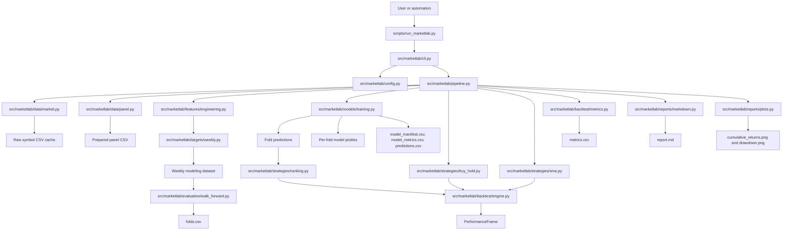
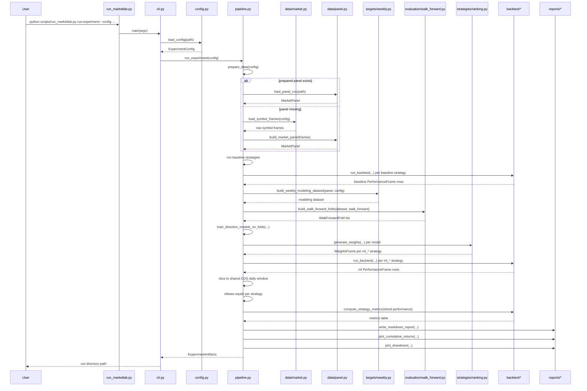
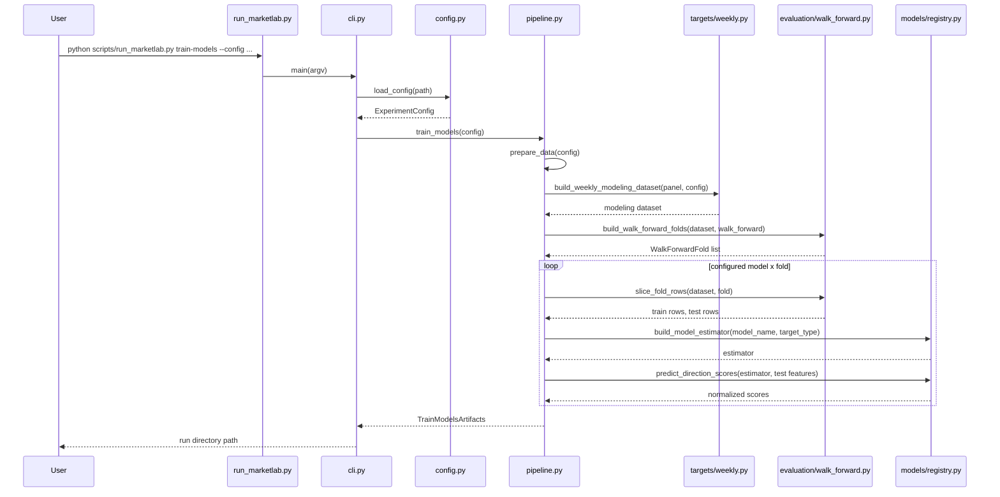
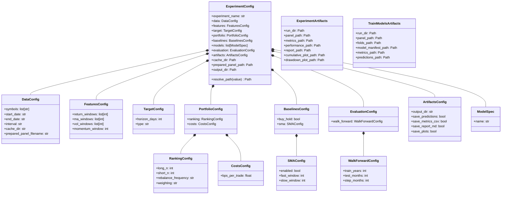

# MarketLab Architecture

## Purpose

MarketLab is a research scaffold for reproducible market experiments over a fixed ETF universe. The current implementation covers the frozen Sprint 1 runtime path plus the first executable Phase 2 ML stack: canonical market data, trailing features, weekly modeling datasets, walk-forward fold generation, a lightweight model registry, the `train-models` command, a ranking strategy, two baseline strategies, unified `run-experiment` baseline-plus-ML comparison, backtests, and reviewable artifacts.

This document ties the current pieces together and freezes the working rules that should guide later iterations.

## Scope

- In scope now:
  - canonical market panel preparation
  - trailing feature engineering
  - weekly modeling dataset generation
  - walk-forward fold generation
  - model registry for configured estimators
  - walk-forward `train-models` execution and artifact generation
  - score-to-weight ranking strategy for ML portfolios
  - `buy_hold` and `sma` baselines
  - unified `run-experiment` comparison across baselines and ML strategies on a shared OOS window
  - daily backtest with turnover-based costs
  - metrics, plots, and Markdown reporting
  - fixture-backed tests and an opt-in real-data E2E runner
- Deferred to later sprints:
  - richer model-comparison reporting
  - CI, Docker, and broader packaging hardening

## Canonical Local Entry Points

- Local repo execution:
  - `python scripts/run_marketlab.py run-experiment --config configs/experiment.weekly_rank.yaml`
  - `python scripts/run_marketlab.py train-models --config configs/experiment.weekly_rank.yaml`
- Real-data E2E:
  - `powershell -ExecutionPolicy Bypass -File scripts/run-e2e.ps1`
- Fast validation:
  - `python -m pytest -q --basetemp .pytest_tmp`

The repo uses a `src/` layout. That means `python -m marketlab.cli ...` is not a safe default for local source execution unless the environment is known to point at the current editable install. The launcher script exists to remove that ambiguity.

## System Map

## Run-Experiment Flow

## Train-Models Flow

## Configuration Model

## Frozen Data Contracts

### MarketPanel

Long-format pandas frame sorted by `symbol`, then `timestamp`.

Required columns:

- `symbol`
- `timestamp`
- `open`
- `high`
- `low`
- `close`
- `volume`
- `adj_close`
- `adj_factor`
- `adj_open`
- `adj_high`
- `adj_low`

### Weekly Modeling Dataset

Weekly modeling rows keyed by `symbol` and `signal_date`.

Required columns:

- `symbol`
- `signal_date`
- `effective_date`
- `target_end_date`
- feature columns derived only from signal-date information
- `forward_return`
- `target`

`target_end_date` is part of the stable contract because walk-forward training depends on it to keep label availability explicit.

### WeightsFrame

Columns:

- `strategy`
- `effective_date`
- `symbol`
- `weight`

The effective date means the next market open when the rebalance becomes active. Strategies that rebalance must emit the full symbol set so zero weights are explicit.

### PerformanceFrame

Columns:

- `date`
- `strategy`
- `gross_return`
- `net_return`
- `turnover`
- `equity`

## Module Responsibilities

### `scripts/run_marketlab.py`

- Canonical local launcher.
- Prepends `src/` to `sys.path`.
- Delegates immediately to `marketlab.cli.main`.
- Exists only to remove ambiguity from editable installs, stale installs, or PATH differences.

### `src/marketlab/cli.py`

- Parses subcommands.
- Loads the experiment config.
- Dispatches to pipeline functions.
- Prints either the prepared panel path or the run directory path.

Best practice:
- Keep this file thin.
- Do not move orchestration logic into CLI handlers.

### `src/marketlab/config.py`

- Defines the dataclass tree for all current config sections.
- Loads YAML and filters unknown keys out at section boundaries.
- Resolves relative paths from repo root when the config lives under `configs/`.

Best practice:
- Keep config loading permissive enough for staged future sections, but keep runtime behavior strict at the domain layer.

### `src/marketlab/pipeline.py`

- Orchestrates the Sprint 1 baseline workflow, the Phase 2 `train-models` artifact path, and the unified Phase 2 `run-experiment` comparison path.
- Decides whether to reuse the prepared panel or rebuild it.
- Runs enabled baselines for backtests and reports.
- Builds modeling datasets, walk-forward folds, trained estimators, ML strategy weights, shared OOS slices, and experiment artifacts.

Best practice:
- Put workflow coordination here, not in strategies, reports, model registry, or CLI code.
- Recompute metrics from the sliced OOS `PerformanceFrame`, not from the full-history backtest output.

### `src/marketlab/data/market.py`

- Loads raw symbol data from cache when available.
- Downloads missing raw histories through `yfinance`.
- Flattens provider column shapes before caching them.

Best practice:
- Keep the provider seam thin and isolated here.
- Treat provider quirks as an ingestion concern, not a backtest concern.

### `src/marketlab/data/panel.py`

- Normalizes raw OHLCV frames into the canonical `MarketPanel`.
- Computes adjusted OHLC columns from `adj_close / close`.
- Validates uniqueness and sorted order.
- Cleans the cached `yfinance` header-row artifact introduced by MultiIndex downloads.

Best practice:
- Protect the panel contract aggressively.
- Make ingestion tolerant to provider shape issues, then make the normalized panel strict.

### `src/marketlab/features/engineering.py`

- Adds trailing returns, moving averages, price-to-MA ratios, MA spreads, rolling volatility, and momentum.
- Operates symbol-by-symbol on adjusted close data.

Best practice:
- Only add trailing features in Sprint 1 and early Phase 2.
- Do not introduce forward-looking features or label leakage.

### `src/marketlab/rebalance.py`

- Centralizes the shared weekly rebalance calendar.
- Resolves the last available signal date in each `W-FRI` period.
- Resolves the next effective trading date after each signal date.
- Resolves the first future rebalance effective date after an existing signal date for fold-boundary flattening.

Best practice:
- Keep weekly signal timing in one shared module so targets, evaluation, and strategies cannot drift.

### `src/marketlab/targets/weekly.py`

- Builds weekly modeling rows from the featured daily panel.
- Copies only signal-date feature values into the weekly sample set.
- Builds forward targets and drops rows whose label horizon is incomplete.

Best practice:
- Keep target generation label-safe and aligned to the existing Friday-close, next-open convention.
- Treat `target_end_date` as part of the modeling dataset contract, not as derived throwaway metadata.

### `src/marketlab/evaluation/walk_forward.py`

- Builds reusable walk-forward folds from the weekly modeling dataset.
- Enforces label-aware training windows by requiring `target_end_date <= test_start`.
- Produces stable fold metadata and row slices for model-training work.

Best practice:
- Keep evaluation logic independent from model wrappers and CLI orchestration.
- Slice training rows by label availability, not just by signal date.

### `src/marketlab/models/registry.py`

- Maps configured model names to concrete scikit-learn estimators.
- Keeps target-type validation at the model-entry seam.
- Produces normalized direction scores from `predict_proba` for downstream ranking work.

Best practice:
- Keep the registry lightweight and explicit.
- Avoid premature model-abstraction layers beyond construction and score extraction.

### `src/marketlab/strategies/buy_hold.py`

- Emits one equal-weight allocation on the first available date.

### `src/marketlab/strategies/sma.py`

- Builds weekly signal dates from the last close in each `W-FRI` period.
- Applies the rebalance on the next market open.
- Emits explicit zero weights when no symbol passes the rule.

Best practice:
- Strategy modules should produce weights, not portfolio returns.
- Keep strategy semantics isolated from execution semantics.

### `src/marketlab/strategies/ranking.py`

- Turns one model's fold predictions into a canonical `WeightsFrame`.
- Ranks longs from the highest scores and shorts from the lowest scores with `symbol` as the deterministic tie-breaker.
- Emits full-symbol weight rows with explicit zeros for non-selected names.
- Adds zero-weight boundary rows at the next rebalance `effective_date` when a later fold does not already begin there.

Best practice:
- Keep ranking prediction-only; do not derive scores from the panel in this layer.
- Keep the exposure policy explicit: `+0.5` total long, `-0.5` total short, gross exposure `1.0`.

### `src/marketlab/backtest/engine.py`

- Joins weights to adjusted open and close data.
- Splits return computation into overnight and intraday components.
- Applies turnover-based trading costs.
- Produces the canonical `PerformanceFrame`.

Best practice:
- Keep execution timing explicit.
- Use adjusted open and close consistently so splits and dividends do not distort returns.
- Backtest one strategy at a time, then concatenate performance frames at the pipeline layer.

### `src/marketlab/backtest/metrics.py`

- Summarizes performance by strategy.
- Computes cumulative return, annualized return, annualized volatility, sharpe-like ratio, max drawdown, hit rate, and turnover metrics.

Best practice:
- Treat this as a reporting summary layer, not a source of trading logic.

### `src/marketlab/reports/markdown.py`

- Produces a compact Markdown report for each run.
- Derives the strategy list from the actual `PerformanceFrame`.
- Switches scope text when ML strategies are present.

### `src/marketlab/reports/plots.py`

- Produces cumulative equity and drawdown charts.

Best practice:
- Report modules should only render artifacts from already-computed outputs.

### `tests/`

- Unit tests protect contracts and math.
- Integration tests validate fixture-backed pipeline behavior.
- Real-data smoke tests stay opt-in because provider behavior and network access are unstable by nature.

### `.codex/skills/`

- Stores repo-local MarketLab roles and internal tooling guidance.
- Encodes conventions for planning, coding, QA, critical review, and market-domain review.

## Best Practices

- Use `python scripts/run_marketlab.py ...` for repo-local execution.
- Use `powershell -ExecutionPolicy Bypass -File scripts/run-e2e.ps1` for full local smoke validation.
- Keep `cli.py` thin and `pipeline.py` orchestration-focused.
- Preserve the `MarketPanel`, weekly modeling dataset, `WeightsFrame`, and `PerformanceFrame` contracts.
- Build features from trailing information only.
- Keep provider normalization inside the data layer.
- Keep strategies responsible for weights, not return calculation.
- Keep backtest timing explicit: Friday-close signal, next-open execution.
- Keep walk-forward training windows label-aware: only train on rows whose `target_end_date` is known by `test_start`.
- Compare baseline and ML strategies on the same shared OOS daily window inside `run-experiment`.
- Treat no allocation as cash with zero return.
- Keep `train-models` artifact-focused; use `run-experiment` for unified baseline-plus-ML comparison.

## Current Risks

- `yfinance` remains an unstable external dependency despite the new column-flattening and cached-header cleanup.
- `run-experiment` now trains models in-process and may leave per-fold model pickles in experiment run directories as a side effect of reusing the training layer.
- richer model-comparison reporting is still deferred beyond the current phase.
- the model registry currently assumes classifier-style `predict_proba` outputs and `target.type="direction"`.
- metric definitions are suitable for a research scaffold, not yet a full institutional evaluation stack.

## Extension Rules For Phase 2

- Add richer reporting without breaking the existing panel, weekly modeling dataset, weights, performance, or shared OOS comparison contracts.
- Keep walk-forward evaluation in the evaluation layer, not inside current strategy modules.
- Reuse the fold engine and its `target_end_date <= test_start` rule rather than rebuilding train/test masks in model code.
- Keep model construction in the registry and workflow orchestration in `pipeline.py`.
- Do not batch multiple strategies into a single `run_backtest(...)` call.
- Do not redesign the current data layer just to support later model abstractions.
- Preserve the local launcher and E2E runner as the default developer entrypoints.
