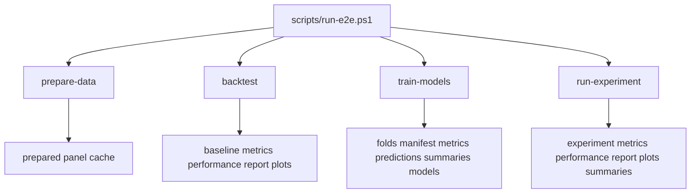

# Phase 2 Results Review

Date: 2026-03-27 (America/Mexico_City)

## Validation Context

- Config: `configs/experiment.weekly_rank.smoke.yaml`
- Universe: `VOO`, `QQQ`, `SMH`, `XLV`, `IEMG`
- Target: 5-day direction
- Walk-forward setup: 3 training years, 3 test months, 3 step months
- Rebalance rule: Friday-close signal, next-open execution
- Shared out-of-sample window: `2024-03-25` to `2024-10-04`

## Validated Runs

- Backtest run: `artifacts/e2e-runs/weekly_rank_smoke/20260328T033816Z`
  - validated baseline artifact set: `metrics.csv`, `performance.csv`, `report.md`, `cumulative_returns.png`, `drawdown.png`
- Train-models run: `artifacts/e2e-runs/weekly_rank_smoke/20260328T033822Z`
  - validated training artifact set: `folds.csv`, `model_manifest.csv`, `model_metrics.csv`, `predictions.csv`, `model_summary.csv`, `fold_summary.csv`, `models/`
- Run-experiment run: `artifacts/e2e-runs/weekly_rank_smoke/20260328T033832Z`
  - validated experiment artifact set: `metrics.csv`, `performance.csv`, `report.md`, `cumulative_returns.png`, `drawdown.png`, `model_summary.csv`, `fold_summary.csv`

## Phase 2 Validation Flow

## What Phase 2 Accomplishes

- builds weekly supervised modeling rows from the canonical market panel
- generates label-aware walk-forward folds
- fits configured models and persists fold-level training artifacts
- converts model predictions into ranked long/short portfolio weights
- compares baseline and ML strategies on the same shared out-of-sample window
- produces reviewable reports plus model-level and fold-level summary tables

## Strategy Results

| strategy | cumulative_return | annualized_return | annualized_volatility | sharpe_like | max_drawdown | hit_rate | avg_turnover | total_turnover |
| --- | ---: | ---: | ---: | ---: | ---: | ---: | ---: | ---: |
| buy_hold | 0.104828 | 0.204528 | 0.167250 | 1.222891 | -0.108074 | 0.548148 | 0.000000 | 0.000000 |
| sma | 0.057813 | 0.110614 | 0.151565 | 0.729811 | -0.117438 | 0.585185 | 0.053580 | 7.233333 |
| ml_gradient_boosting | 0.184913 | 0.372612 | 0.091278 | 4.082143 | -0.018679 | 0.533333 | 0.166667 | 22.500000 |
| ml_logistic_regression | -0.031216 | -0.057481 | 0.079849 | -0.719872 | -0.054276 | 0.459259 | 0.085185 | 11.500000 |
| ml_random_forest | 0.022885 | 0.043142 | 0.078457 | 0.549879 | -0.063447 | 0.451852 | 0.170370 | 23.000000 |

## Model Summary

| model_name | estimator_label | fold_count | first_test_start | last_test_end | mean_accuracy | mean_roc_auc | mean_log_loss | mean_target_rate | mean_prediction_rate | mean_train_rows | mean_test_rows |
| --- | --- | ---: | --- | --- | ---: | ---: | ---: | ---: | ---: | ---: | ---: |
| gradient_boosting | GradientBoostingClassifier | 2 | 2024-03-22 | 2024-09-27 | 0.528571 | 0.596090 | 0.715161 | 0.600000 | 0.528571 | 780.0 | 70.0 |
| logistic_regression | LogisticRegression | 2 | 2024-03-22 | 2024-09-27 | 0.564286 | 0.513832 | 0.691110 | 0.600000 | 0.807143 | 780.0 | 70.0 |
| random_forest | RandomForestClassifier | 2 | 2024-03-22 | 2024-09-27 | 0.635714 | 0.643147 | 0.657055 | 0.600000 | 0.607143 | 780.0 | 70.0 |

## Fold Summary

| fold_id | label_cutoff | test_start | test_end | train_rows | test_rows | models_evaluated | mean_accuracy | mean_roc_auc | mean_log_loss | best_model_by_roc_auc | best_roc_auc |
| --- | --- | --- | --- | ---: | ---: | ---: | ---: | ---: | ---: | --- | ---: |
| 1 | 2024-03-22 | 2024-03-22 | 2024-06-21 | 780 | 70 | 3 | 0.552381 | 0.547500 | 0.705330 | random_forest | 0.580000 |
| 2 | 2024-06-28 | 2024-06-28 | 2024-09-27 | 780 | 70 | 3 | 0.600000 | 0.621212 | 0.670220 | random_forest | 0.706294 |

## Safe Interpretation

- This smoke run is mixed rather than one-sided. `ml_gradient_boosting` produced the best realized portfolio outcome over the shared out-of-sample window at `+18.49%` cumulative return with `-1.87%` max drawdown.
- `random_forest` was the strongest model by mean fold metrics in this run, including the best mean ROC AUC (`0.643147`) and the best ROC AUC in both folds.
- The model-level ranking and the realized portfolio ranking are not the same thing in this sample. It is safe to say that the best predictive model by fold metrics was not the same as the best realized trading strategy.
- This smoke run shows internally coherent timing, shared OOS slicing, and explicit turnover cost application for research validation.

## Caveats

- This evidence comes from only 2 folds.
- The smoke universe contains only 5 ETFs.
- The shared out-of-sample window is short: `2024-03-25` to `2024-10-04`.
- `buy_hold` and `sma` are long-only baselines, while the ML strategies are market-neutral long/short portfolios.
- The ML strategies have materially higher turnover than the baselines, so results are more sensitive to cost assumptions.
- `annualized_return`, `annualized_volatility`, and `sharpe_like` are unstable on a short smoke window and should not be treated as robust model-selection evidence.
- This is a research milestone review, not a production-readiness claim and not proof that the ML stack is generally superior.

