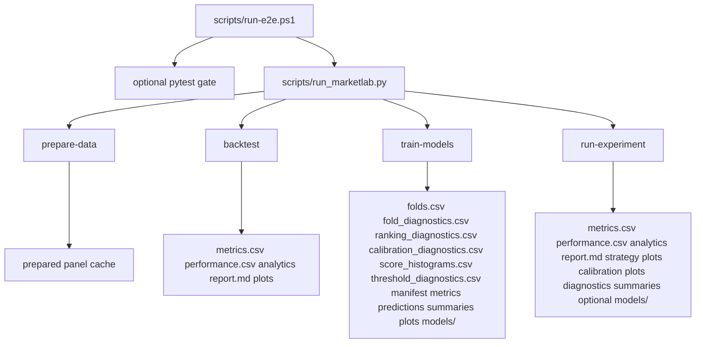
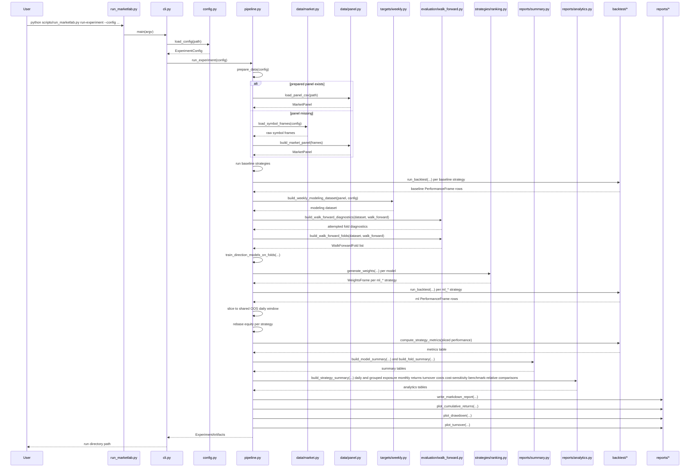
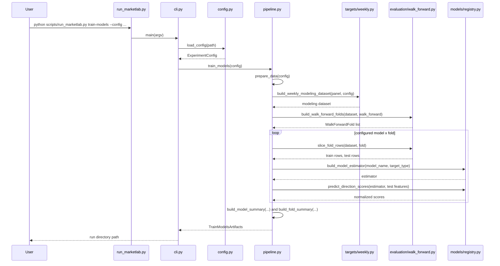

# MarketLab Architecture

## Purpose

MarketLab is a package-first research toolkit for reproducible market experiments over a fixed ETF universe. The current implementation includes canonical market data, trailing features, weekly modeling datasets, walk-forward fold generation, additive guardrail and embargo controls, skipped-fold diagnostics, a lightweight model registry, the `train-models` command, ranking-aware fold evaluation and downside diagnostics, calibration and threshold diagnostics, a ranking strategy, three baseline strategies including periodic allocation baselines, executable long-only mean-variance and risk-parity baselines, optimizer input and covariance scaffolding for later optimized baselines, unified `run-experiment` baseline-plus-ML comparison, fold and model summaries, exposure-aware strategy analytics artifacts, benchmark-relative reporting artifacts, turnover and cost-sensitivity diagnostics, backtests, and reviewable artifacts.

This document ties the current pieces together and records the working rules that should guide later iterations.

## Scope

- In scope now:
  - canonical market panel preparation
  - trailing feature engineering
  - weekly modeling dataset generation
  - walk-forward fold generation with additive guardrails, embargo controls, and skipped-fold diagnostics
  - model registry for configured estimators
  - walk-forward `train-models` execution and artifact generation
  - score-to-weight ranking strategies for ML portfolios, including long-short, long-only, confidence-gated cash-underfilled variants, and additive exposure caps
  - fold and model summary artifacts
  - ranking-aware model evaluation artifacts with downside diagnostics
  - calibration, score-histogram, and threshold-sweep diagnostics plus review plots
  - `buy_hold`, `sma`, config-defined allocation baselines, the executable `mean_variance` and `risk_parity` optimized baselines, and optimizer input scaffolding for later optimized baselines
  - unified `run-experiment` comparison across baselines and ML strategies on a shared OOS window
  - daily backtest with turnover-based costs
  - metrics, exposure-aware, benchmark-relative, and cost-sensitivity strategy analytics CSVs, plots, and Markdown reporting
  - required PR CI for lint, docs, packaging, unit tests, and offline integration tests
  - Docker packaging for the installed CLI plus a manual GitHub Actions Docker runner
  - release automation with a monthly-batching Release PR and a PyPI publish path
  - fixture-backed tests and a real-data E2E runner that validates baseline, training, experiment, and analytics artifact sets
- Deferred to later sprints:
  - scheduled Docker automation for recurring runs
  - broader packaging hardening beyond the current public-release path

## Canonical Local Entry Points

- Local repo execution:
  - `python scripts/run_marketlab.py run-experiment --config configs/experiment.weekly_rank.yaml`
  - `python scripts/run_marketlab.py train-models --config configs/experiment.weekly_rank.yaml`
- Installed package bootstrap:
  - `marketlab --version`
  - `marketlab list-configs`
  - `marketlab write-config --name weekly_rank --output weekly_rank.yaml`
  - `marketlab run-experiment --config weekly_rank.yaml`
- Local Docker validation:
  - `docker build -t marketlab-cli .`
  - `docker run --rm marketlab-cli --help`
- Manual GitHub Actions Docker automation:
  - `.github/workflows/docker-runner.yml`
  - `workflow_dispatch` only
  - defaults to `backtest` on `configs/experiment.weekly_rank.smoke.yaml`
- Release automation:
  - `.github/workflows/release.yml`
  - updates one open Release PR on merges to `master`
  - publishes only when that Release PR is merged
- Real-data E2E:
  - `powershell -ExecutionPolicy Bypass -File scripts/run-e2e.ps1`
  - covers `prepare-data`, `backtest`, `train-models`, and `run-experiment` on the smoke config
- Fast validation:
  - `python -m pytest -q --basetemp .pytest_tmp`

The repo uses a `src/` layout. That means `python -m marketlab.cli ...` is not a safe default for local source execution unless the environment is known to point at the current editable install. The launcher script exists to remove that ambiguity.

The installed package uses bundled example config templates so a pip-installed user can bootstrap a working run config without needing the repository checkout. That keeps the distribution self-contained while preserving the repo-local launcher as the default development path.

The Docker image deliberately uses the installed `marketlab` console script instead of the repo-local launcher. That split keeps local development pointed at the source tree while the container validates the packaged CLI path.

## Validation Flow



## Automation Split

```mermaid
flowchart TD
    PRCI[Required PR CI] --> Tox[lint docs package py312 integration]
    Manual[Docker Runner workflow_dispatch] --> Build[Dockerfile build]
    Build --> InstalledCli[installed marketlab entrypoint]
    InstalledCli --> SmokeConfig[historical smoke config]
    InstalledCli --> DockerArtifacts[/app/artifacts upload]
    Master[push to master] --> ReleasePlease[release-please job]
    ReleasePlease --> ReleasePR[open Release PR]
    ReleasePR -->|merge| Publish[build tag, GitHub release, PyPI publish]
```

The required CI path stays offline and deterministic through tox. The Docker runner is separate, manual, and allowed to exercise the historical real-data smoke config without becoming a required PR gate. Release automation is also separate from required PR CI: normal merges update the open Release PR, and only the Release PR merge cuts a public release.
## Exposure Analytics Rules

- Exposure analytics are derived from the actual end-of-day drifted book, not from pre-trade targets.
- `daily_exposure.csv` reports long, short, gross, and net exposure per strategy and date.
- `cash_weight` is exposure-style slack based on gross exposure.
- `engine_cash_weight` is the engine's carried cash or collateral weight and can remain large in long-short books.
- `group_exposure.csv` is only written when `data.symbol_groups` covers the run universe, and it keeps long and short sleeves separate so concentration is not hidden by netting.
- `strategy_summary.csv` appends average exposure, cash, active-position, and concentration fields without changing the existing leading performance columns.

## Benchmark-Relative Reporting Rules

- Benchmark-relative analytics are optional and only run when `evaluation.benchmark_strategy` is set.
- The benchmark is an existing strategy name already present in the run, not a raw symbol or download instruction.
- `benchmark_relative.csv` aligns each strategy to the benchmark on shared dates and stores daily active return plus relative equity.
- `strategy_summary.csv` appends benchmark-relative fields such as excess cumulative return, tracking error, information ratio, correlation, and capture ratios without changing the existing leading columns.
- Benchmark-relative reporting applies to `backtest` and `run-experiment`, but not to `train-models`.

## Cost Sensitivity Rules

- Cost sensitivity is optional and configured under `evaluation.cost_sensitivity_bps`.
- `cost_sensitivity.csv` is still written for `backtest` and `run-experiment` even when that list is empty; the default grid always includes `0.0` bps and the configured `portfolio.costs.bps_per_trade`.
- Sensitivity rows are derived from the existing `PerformanceFrame` by repricing `gross_return` with the same linear turnover-cost model; MarketLab does not rerun strategies for alternate cost assumptions.
- The `0.0` bps rows are theoretical gross-return baselines, while the row at the configured trading cost should match the current net-return path already reported elsewhere.
- Cost-sensitivity reporting applies to `backtest` and `run-experiment`, but not to `train-models`.


## Optimized Baseline Rules

- `baselines.optimized.method="mean_variance"` and `baselines.optimized.method="risk_parity"` are executable optimized baselines in the current phase.
- `black_litterman` remains scaffold-only and fails fast with an explicit not-implemented error.
- Trailing return windows are built from adjusted close data only, and the latest included return must end on the `signal_date`.
- Optimized weights are applied on the next market open after the `signal_date`, and no allocation is emitted before the first full optimizer lookback window exists.
- `target_gross_exposure` is a long-only invested-fraction request; any undeployed exposure remains cash in the backtest engine.
- `portfolio.risk.max_position_weight` and `portfolio.risk.max_group_weight` are enforced as hard optimizer constraints for the long-only optimized methods.
- `risk_aversion` applies only to `mean_variance`.
- `risk_parity` uses only the configured covariance estimator and does not consume expected-return inputs.
- Binding position or group caps turn `risk_parity` into the best feasible approximation to equal risk contributions rather than exact parity.
- External covariance inputs must be square daily-return covariance matrices keyed by the configured symbols.
- External expected-return inputs must contain exactly `symbol,expected_return` in daily decimal units.

## System Map

```mermaid
flowchart TD
    User[User or automation] --> Launcher[scripts/run_marketlab.py]
    User --> DockerWorkflow[.github/workflows/docker-runner.yml]
    Launcher --> CLI[src/marketlab/cli.py]
    DockerWorkflow --> DockerImage[Dockerfile]
    DockerImage --> InstalledCLI[marketlab console script]
    InstalledCLI --> CLI
    CLI --> Config[src/marketlab/config.py]
    CLI --> Pipeline[src/marketlab/pipeline.py]

    Pipeline --> Market[src/marketlab/data/market.py]
    Pipeline --> Panel[src/marketlab/data/panel.py]
    Pipeline --> Features[src/marketlab/features/engineering.py]
    Features --> Targets[src/marketlab/targets/weekly.py]
    Targets --> ModelingDataset[Weekly modeling dataset]
    ModelingDataset --> Evaluation[src/marketlab/evaluation/walk_forward.py]
    Pipeline --> Models[src/marketlab/models/training.py]
    Models --> Predictions[Fold predictions]
    Predictions --> Ranking[src/marketlab/strategies/ranking.py]
    Pipeline --> Summary[src/marketlab/reports/summary.py]
    Pipeline --> Analytics[src/marketlab/reports/analytics.py]
    Pipeline --> BuyHold[src/marketlab/strategies/buy_hold.py]
    Pipeline --> Allocation[src/marketlab/strategies/allocation.py]
    Pipeline --> SMA[src/marketlab/strategies/sma.py]
    BuyHold --> Engine[src/marketlab/backtest/engine.py]
    Allocation --> Engine
    SMA --> Engine
    Ranking --> Engine
    Engine --> Performance[PerformanceFrame]
    Pipeline --> Metrics[src/marketlab/backtest/metrics.py]
    Summary --> ModelSummaryCsv[model_summary.csv]
    Summary --> FoldSummaryCsv[fold_summary.csv]
    Analytics --> StrategySummaryCsv[strategy_summary.csv]
    Analytics --> BenchmarkRelativeCsv[benchmark_relative.csv]
    Analytics --> CostSensitivityCsv[cost_sensitivity.csv]
    Analytics --> MonthlyReturnsCsv[monthly_returns.csv]
    Analytics --> TurnoverCostsCsv[turnover_costs.csv]
    Pipeline --> Markdown[src/marketlab/reports/markdown.py]
    Pipeline --> Plots[src/marketlab/reports/plots.py]

    Market --> RawCache[Raw symbol CSV cache]
    Panel --> PreparedPanel[Prepared panel CSV]
    Evaluation --> FoldDefs[folds.csv]
    Evaluation --> FoldDiagnosticsCsv[fold_diagnostics.csv]
    Models --> ModelArtifacts[Per-fold model pickles]
    Models --> TrainArtifacts[model_manifest.csv, model_metrics.csv, predictions.csv, ranking_diagnostics.csv, calibration_diagnostics.csv, score_histograms.csv, threshold_diagnostics.csv]
    Metrics --> MetricsCsv[metrics.csv]
    Markdown --> ReportMd[report.md]
    Plots --> PlotFiles[cumulative_returns.png drawdown.png and turnover.png]
```



## Run-Experiment Flow



## Train-Models Flow



## Configuration Model

```mermaid
classDiagram
    class ExperimentConfig {
      +experiment_name: str
      +data: DataConfig
      +features: FeaturesConfig
      +target: TargetConfig
      +portfolio: PortfolioConfig
      +baselines: BaselinesConfig
      +models: list[ModelSpec]
      +evaluation: EvaluationConfig
      +artifacts: ArtifactsConfig
      +cache_dir: Path
      +prepared_panel_path: Path
      +output_dir: Path
      +resolve_path(value) Path
    }

    class DataConfig {
      +symbols: list[str]
      +start_date: str
      +end_date: str
      +interval: str
      +cache_dir: str
      +prepared_panel_filename: str
      +symbol_groups: dict[str, str]
    }

    class FeaturesConfig {
      +return_windows: list[int]
      +ma_windows: list[int]
      +vol_windows: list[int]
      +momentum_window: int
    }

    class TargetConfig {
      +horizon_days: int
      +type: str
    }

    class PortfolioConfig {
      +ranking: RankingConfig
      +risk: RiskConfig
      +costs: CostsConfig
    }

    class RankingConfig {
      +long_n: int
      +short_n: int
      +rebalance_frequency: str
      +weighting: str
      +mode: str
      +min_score_threshold: float
      +cash_when_underfilled: bool
    }

    class RiskConfig {
      +max_position_weight: float | None
      +max_group_weight: float | None
      +max_long_exposure: float | None
      +max_short_exposure: float | None
    }

    class CostsConfig {
      +bps_per_trade: float
    }

    class BaselinesConfig {
      +buy_hold: bool
      +sma: SMAConfig
      +allocation: AllocationConfig
      +optimized: OptimizedConfig
    }

    class SMAConfig {
      +enabled: bool
      +fast_window: int
      +slow_window: int
    }

    class AllocationConfig {
      +enabled: bool
      +mode: str
      +symbol_weights: dict[str, float]
      +group_weights: dict[str, float]
    }
    class OptimizedConfig {
      +enabled: bool
      +method: str
      +lookback_days: int
      +rebalance_frequency: str
      +covariance_estimator: str
      +external_covariance_path: str
      +expected_return_source: str
      +external_expected_returns_path: str
      +long_only: bool
      +target_gross_exposure: float
      +risk_aversion: float
    }

    class EvaluationConfig {
      +walk_forward: WalkForwardConfig
    }

    class WalkForwardConfig {
      +train_years: int
      +test_months: int
      +step_months: int
      +min_train_rows: int
      +min_test_rows: int
      +min_train_positive_rate: float
      +min_test_positive_rate: float
      +embargo_periods: int
    }

    class ArtifactsConfig {
      +output_dir: str
      +save_predictions: bool
      +save_metrics_csv: bool
      +save_report_md: bool
      +save_plots: bool
    }

    class ModelSpec {
      +name: str
    }

    class ExperimentArtifacts {
      +run_dir: Path
      +panel_path: Path
      +metrics_path: Path
      +performance_path: Path
      +strategy_summary_path: Path
      +monthly_returns_path: Path
      +turnover_costs_path: Path
      +daily_exposure_path: Path
      +group_exposure_path: Path | None
      +benchmark_relative_path: Path | None
      +model_summary_path: Path | None
      +fold_diagnostics_path: Path | None
      +ranking_diagnostics_path: Path | None
      +fold_summary_path: Path | None
      +report_path: Path | None
      +cumulative_plot_path: Path | None
      +drawdown_plot_path: Path | None
      +turnover_plot_path: Path | None
      +calibration_curves_plot_path: Path | None
      +score_histograms_plot_path: Path | None
      +threshold_sweeps_plot_path: Path | None
      +calibration_diagnostics_path: Path | None
      +score_histograms_path: Path | None
      +threshold_diagnostics_path: Path | None
    }

    class TrainModelsArtifacts {
      +run_dir: Path
      +panel_path: Path
      +folds_path: Path
      +fold_diagnostics_path: Path
      +ranking_diagnostics_path: Path
      +calibration_diagnostics_path: Path
      +score_histograms_path: Path
      +threshold_diagnostics_path: Path
      +model_manifest_path: Path
      +metrics_path: Path | None
      +predictions_path: Path | None
      +calibration_curves_plot_path: Path | None
      +score_histograms_plot_path: Path | None
      +threshold_sweeps_plot_path: Path | None
      +model_summary_path: Path
      +fold_summary_path: Path
    }

    ExperimentConfig *-- DataConfig
    ExperimentConfig *-- FeaturesConfig
    ExperimentConfig *-- TargetConfig
    ExperimentConfig *-- PortfolioConfig
    ExperimentConfig *-- BaselinesConfig
    ExperimentConfig *-- EvaluationConfig
    ExperimentConfig *-- ArtifactsConfig
    ExperimentConfig *-- ModelSpec
    PortfolioConfig *-- RankingConfig
    PortfolioConfig *-- RiskConfig
    PortfolioConfig *-- CostsConfig
    BaselinesConfig *-- SMAConfig
    BaselinesConfig *-- AllocationConfig
    EvaluationConfig *-- WalkForwardConfig
```



## Frozen Data Contracts

### MarketPanel

Long-format pandas frame sorted by `symbol`, then `timestamp`.

Required columns:

- `symbol`
- `timestamp`
- `open`
- `high`
- `low`
- `close`
- `volume`
- `adj_close`
- `adj_factor`
- `adj_open`
- `adj_high`
- `adj_low`

### Weekly Modeling Dataset

Weekly modeling rows keyed by `symbol` and `signal_date`.

Required columns:

- `symbol`
- `signal_date`
- `effective_date`
- `target_end_date`
- feature columns derived only from signal-date information
- `forward_return`
- `target`

`target_end_date` is part of the stable contract because walk-forward training depends on it to keep label availability explicit.

### WeightsFrame

Columns:

- `strategy`
- `effective_date`
- `symbol`
- `weight`

The effective date means the next market open when the rebalance becomes active. Strategies that rebalance must emit the full symbol set so zero weights are explicit.

### PerformanceFrame

Columns:

- `date`
- `strategy`
- `gross_return`
- `net_return`
- `turnover`
- `equity`

## Module Responsibilities

### `scripts/run_marketlab.py`

- Canonical local launcher.
- Prepends `src/` to `sys.path`.
- Delegates immediately to `marketlab.cli.main`.
- Exists only to remove ambiguity from editable installs, stale installs, or PATH differences.

### `scripts/run-e2e.ps1`

- Runs the current real-data smoke validation path against the smoke config.
- Optionally gates on fixture-backed pytest first.
- Verifies artifact sets for `prepare-data`, `backtest`, `train-models`, and `run-experiment`, including analytics outputs where applicable.
- Prints the resolved run directories used for the smoke review.

Best practice:
- Keep the smoke assertions aligned with the current command artifact surface.
- Treat smoke results as validation evidence, not robust model-selection proof.

### `Dockerfile`

- Builds a packaged MarketLab CLI image from the repository source.
- Installs the package into a Python 3.12 runtime image.
- Copies checked-in `configs/` into `/app/configs`.
- Runs as a non-root user with writable `/app/artifacts`.

Best practice:
- Keep Docker as an execution wrapper around the installed package, not as a second source-tree launcher.
- Preserve the repo-local launcher for development and the installed CLI for container automation.

### `.github/workflows/docker-runner.yml`

- Manually dispatches a Dockerized MarketLab run for `backtest`, `train-models`, or `run-experiment`.
- Builds the image, runs the selected command, captures the resolved run directory, and uploads copied artifacts.
- Keeps the workflow outside the required PR CI check set.

Best practice:
- Treat this workflow as manual historical smoke automation, not as a rolling live-market schedule.
- Keep required PR CI deterministic and offline; use the Docker runner when a packaged execution path or real-data smoke replay is the goal.

### `.github/workflows/release.yml`

- Runs on pushes to `master`.
- Uses release-please to keep one open Release PR updated with unreleased conventional commits.
- Builds release distributions from the created tag, attaches them to the GitHub Release, and publishes them through PyPI Trusted Publishing when the Release PR is merged.

Best practice:
- Treat the Release PR as the monthly or feature-batch public release gate.
- Allow `master` to move ahead of the last public release between release batches.
- Keep repo settings such as the `pypi` environment and branch protection outside the workflow file itself.

### `.github/release-please-config.json`

- Defines the root-package release automation settings for the Python package.
- Keeps the project on a single Release PR track with `v`-prefixed tags and changelog updates in `CHANGELOG.md`.

Best practice:
- Keep release-please configuration scoped to the root package unless the repo becomes multi-package later.
- Let release-please own `CHANGELOG.md` and the release version files once the workflow is active.

### `src/marketlab/cli.py`

- Parses subcommands.
- Loads the experiment config.
- Dispatches to pipeline functions.
- Prints either the prepared panel path, the run directory path, or an installed-package helper result.

Best practice:
- Keep this file thin.
- Do not move orchestration logic into CLI handlers.

### `src/marketlab/resources/*`

- Packages bundled example config templates for installed-package use.
- Provides the version fallback and config-template helpers used by the CLI.

Best practice:
- Keep the packaged templates aligned with the checked-in repo configs.
- Treat the packaged resources as bootstrap helpers for installed users, not as a second config source of truth.

### `src/marketlab/config.py`

- Defines the dataclass tree for all current config sections.
- Loads YAML and filters unknown keys out at section boundaries.
- Resolves relative paths from repo root when the config lives under `configs/`.

Best practice:
- Keep config loading permissive enough for staged future sections, but keep runtime behavior strict at the domain layer.

### `src/marketlab/pipeline.py`

- Orchestrates the baseline backtest workflow, the `train-models` artifact path, and the unified `run-experiment` comparison path.
- Decides whether to reuse the prepared panel or rebuild it.
- Runs enabled baselines for backtests and reports.
- Builds modeling datasets, walk-forward folds, attempted-fold diagnostics, trained estimators, ML strategy weights, shared OOS slices, summary tables, analytics tables, and experiment artifacts.

Best practice:
- Put workflow coordination here, not in strategies, reports, model registry, or CLI code.
- Recompute metrics from the sliced OOS `PerformanceFrame`, not from the full-history backtest output.

### `src/marketlab/data/market.py`

- Loads raw symbol data from cache when available.
- Downloads missing raw histories through `yfinance`.
- Flattens provider column shapes before caching them.

Best practice:
- Keep the provider seam thin and isolated here.
- Treat provider quirks as an ingestion concern, not a backtest concern.

### `src/marketlab/data/panel.py`

- Normalizes raw OHLCV frames into the canonical `MarketPanel`.
- Computes adjusted OHLC columns from `adj_close / close`.
- Validates uniqueness and sorted order.
- Cleans the cached `yfinance` header-row artifact introduced by MultiIndex downloads.

Best practice:
- Protect the panel contract aggressively.
- Make ingestion tolerant to provider shape issues, then make the normalized panel strict.

### `src/marketlab/features/engineering.py`

- Adds trailing returns, moving averages, price-to-MA ratios, MA spreads, rolling volatility, and momentum.
- Operates symbol-by-symbol on adjusted close data.

Best practice:
- Only add trailing features unless a future phase deliberately expands the feature contract.
- Do not introduce forward-looking features or label leakage.

### `src/marketlab/rebalance.py`

- Centralizes the shared weekly rebalance calendar.
- Resolves the last available signal date in each `W-FRI` period.
- Resolves the next effective trading date after each signal date.
- Resolves the first future rebalance effective date after an existing signal date for fold-boundary flattening.

Best practice:
- Keep weekly signal timing in one shared module so targets, evaluation, and strategies cannot drift.

### `src/marketlab/targets/weekly.py`

- Builds weekly modeling rows from the featured daily panel.
- Copies only signal-date feature values into the weekly sample set.
- Builds forward targets and drops rows whose label horizon is incomplete.

Best practice:
- Keep target generation label-safe and aligned to the existing Friday-close, next-open convention.
- Treat `target_end_date` as part of the modeling dataset contract, not as derived throwaway metadata.

### `src/marketlab/evaluation/walk_forward.py`

- Builds reusable walk-forward folds from the weekly modeling dataset.
- Produces additive attempted-fold diagnostics with explicit skip reasons.
- Enforces label-aware training windows by requiring `target_end_date <= label_cutoff`, including optional embargo handling.
- Produces stable accepted-fold metadata and row slices for model-training work.
- Keeps fold acceptance separate from the later ranking-aware model evaluation layer.

Best practice:
- Keep evaluation logic independent from model wrappers and CLI orchestration.
- Slice training rows by label availability, not just by signal date.

### `src/marketlab/models/registry.py`

- Maps configured model names to concrete scikit-learn estimators.
- Keeps target-type validation at the model-entry seam.
- Produces normalized direction scores from `predict_proba` for downstream ranking work.
- Exposes a pure evaluation helper layer that derives classification, ranking, and downside diagnostics without changing model fitting.
- Keeps ranking diagnostics mode-aware for `long_short` and `long_only` while still leaving threshold and cash-underfilled execution semantics in the strategy layer.
- The default comparison set now includes six sklearn-only classifiers: `logistic_regression`, `logistic_l1`, `random_forest`, `extra_trees`, `gradient_boosting`, and `hist_gradient_boosting`.

Best practice:
- Keep the registry lightweight and explicit.
- Avoid premature model-abstraction layers beyond construction and score extraction.

### `src/marketlab/strategies/allocation.py`

- Builds periodic long-only target-weight baselines from config.
- Reuses the shared rebalance cadence and emits full-symbol target rows on the first trading date and each later effective rebalance date.
- Supports equal, exact symbol-weight, and group-sleeve allocation modes.

### `src/marketlab/strategies/optimized.py`

- Builds reusable optimizer input windows from the daily adjusted-close panel without introducing look-ahead.
- Produces trailing common-date daily return matrices keyed by `signal_date` and `effective_date`.
- Provides covariance helpers for `sample`, `ewma`, `diagonal_shrinkage`, and `external_csv` inputs.
- Provides expected-return helpers for `historical_mean` and `external_csv` inputs.
- Reorders and validates external covariance and expected-return files against `data.symbols`.
- Executes the long-only `mean_variance` and `risk_parity` baselines with hard position and group constraints, while leaving `black_litterman` scaffold-only.

Best practice:
- Keep adjusted-close return windows and optimizer timing leakage-safe: signal on the close, execute on the next open.
- Keep hard constraints explicit inside the solver instead of post-solve clipping.
- Reject malformed external files early and keep unsupported optimized methods on explicit errors until they are implemented.

### `src/marketlab/strategies/buy_hold.py`

- Emits one equal-weight allocation on the first available date and then lets weights drift until the backtest engine sees another target row.

### `src/marketlab/strategies/sma.py`

- Builds weekly signal dates from the last close in each `W-FRI` period.
- Applies the rebalance on the next market open.
- Emits explicit zero weights when no symbol passes the rule.

Best practice:
- Strategy modules should produce weights, not portfolio returns.
- Keep strategy semantics isolated from execution semantics.

### `src/marketlab/strategies/ranking.py`

- Turns one model's fold predictions into a canonical `WeightsFrame`.
- Supports `long_short` and `long_only` execution modes plus additive score-threshold gating.
- Applies optional post-selection risk caps for single-name, group, and side exposure in weight space.
- Uses `symbol` as the deterministic tie-breaker for both long and short candidate ranking.
- Emits full-symbol weight rows with explicit zeros for non-selected names and can either zero the full basket or leave missing exposure in cash when the basket is underfilled.
- Adds zero-weight boundary rows at the next rebalance `effective_date` when a later fold does not already begin there.

Best practice:
- Keep ranking prediction-only; do not derive scores from the panel in this layer.
- Keep the exposure policy explicit: default `long_short` uses `+0.5` total long and `-0.5` total short, while `long_only` uses `+1.0` total long exposure with any missing slots left in cash only when configured.
- Treat the tracked `configs/experiment.voo_long_only.ytd.yaml` example as a directional timing configuration, not as a cross-sectional ranking benchmark.

### `src/marketlab/backtest/engine.py`

- Joins target weights to adjusted open and close data.
- Lets positions drift between rebalance dates and applies new target weights only when a strategy emits another `effective_date` row.
- Splits return computation into overnight and intraday components.
- Applies turnover-based trading costs.
- Produces the canonical `PerformanceFrame`.

Best practice:
- Keep execution timing explicit.
- Use adjusted open and close consistently so splits and dividends do not distort returns.
- Backtest one strategy at a time, then concatenate performance frames at the pipeline layer.
### `src/marketlab/backtest/metrics.py`

- Summarizes performance by strategy.
- Computes cumulative return, annualized return, annualized volatility, sharpe-like ratio, max drawdown, hit rate, and turnover metrics.

Best practice:
- Treat this as a reporting summary layer, not a source of trading logic.

### `src/marketlab/reports/analytics.py`

- Builds strategy-level analytics tables from the canonical `PerformanceFrame`.
- Produces `strategy_summary.csv`, `monthly_returns.csv`, `turnover_costs.csv`, and `cost_sensitivity.csv`.
- Keeps analytics derived and deterministic rather than introducing new backtest state.

Best practice:
- Keep analytics builders pure and schema-stable.
- Derive analytics from the existing `PerformanceFrame`, not from alternate portfolio state.

### `src/marketlab/reports/markdown.py`

- Produces a compact Markdown report for each run.
- Derives the strategy list from the actual `PerformanceFrame`.
- Adds strategy summary, monthly net return, turnover-and-cost, and cost-sensitivity sections when those analytics are available.
- Switches scope text when ML strategies are present.
- Reports the best model by mean ROC AUC, mean top-bucket return, and mean top-bottom spread when those model-summary fields are available.
- Adds a compact calibration-and-threshold section when calibration summaries or threshold diagnostics are available, including relative links to the diagnostic plots.

### `src/marketlab/reports/summary.py`

- Builds fold-level and model-level summary tables from existing training metrics and manifests.
- Keeps the reporting summaries additive and derived from raw training outputs.
- Preserves ROC AUC continuity while adding long-only-friendly top-bucket winners, spread-based ranking winners, downside-oriented aggregates, and additive calibration summary fields.

Best practice:
- Keep summary generation pure and deterministic.
- Do not invent new metrics in the summary layer.

### `src/marketlab/reports/plots.py`

- Produces cumulative equity, drawdown, and turnover charts.
- Also renders calibration curves, target-class score histograms, and threshold sweep review plots from the persisted diagnostic CSVs.

Best practice:
- Report modules should only render artifacts from already-computed outputs.

### `tests/`

- Unit tests protect contracts and math.
- Integration tests validate fixture-backed pipeline behavior.
- The real-data smoke runner validates baseline backtest, training artifacts, experiment artifacts, analytics outputs, and summary outputs on real data.
- Real-data smoke tests stay opt-in because provider behavior and network access are unstable by nature.

### User-Local Codex Skills

- MarketLab role skills are expected to live in the developer's user-local Codex home, not in the repository.
- Keep repo automation and public packaging independent from private Codex workflow assets.

## Best Practices

- Use `python scripts/run_marketlab.py ...` for repo-local execution.
- Use the Docker image to validate the installed `marketlab` CLI path, not to replace the repo-local launcher during development.
- Use `powershell -ExecutionPolicy Bypass -File scripts/run-e2e.ps1` for full local smoke validation of the current artifact surface.
- Treat `.github/workflows/docker-runner.yml` as manual historical smoke automation, not as a required CI or rolling production schedule.
- Treat `.github/workflows/release.yml` as a batching workflow: normal merges update the Release PR, and Release PR merge triggers the public release.
- Keep `cli.py` thin and `pipeline.py` orchestration-focused.
- Preserve the `MarketPanel`, weekly modeling dataset, `WeightsFrame`, and `PerformanceFrame` contracts.
- Build features from trailing information only.
- Keep provider normalization inside the data layer.
- Keep strategies responsible for weights, not return calculation.
- Keep backtest timing explicit: Friday-close signal, next-open execution.
- Keep walk-forward training windows label-aware: only train on rows whose `target_end_date` is known by `label_cutoff`, not just by `test_start`.
- Compare baseline and ML strategies on the same shared OOS daily window inside `run-experiment`.
- Keep `buy_hold` distinct from periodic allocation baselines: one initial target row for drifted exposure versus repeated target rows for scheduled rebalancing.
- Derive `model_summary.csv`, `fold_summary.csv`, calibration summaries, and ranking-aware winners from existing model metrics and manifests, not from new training state.
- Treat no allocation as cash with zero return.
- Keep `train-models` artifact-focused; use `run-experiment` for unified baseline-plus-ML comparison.
- Use the smoke runner to validate the full current artifact surface after runtime changes.

## Current Risks

- `yfinance` remains an unstable external dependency despite the new column-flattening and cached-header cleanup.
- `run-experiment` now trains models in-process and may leave per-fold model pickles in experiment run directories as a side effect of reusing the training layer.
- summary and analytics outputs are derived from the existing training/performance artifacts, so metric changes propagate through both the raw CSVs and the report tables.
- the model registry currently assumes classifier-style `predict_proba` outputs and `target.type="direction"`.
- metric definitions are suitable for a research scaffold, not yet a full institutional evaluation stack.
- the public publish path depends on external GitHub and PyPI setup, including the `pypi` environment and Trusted Publisher configuration.

## Extension Rules

- Add richer reporting without breaking the existing panel, weekly modeling dataset, weights, performance, or shared OOS comparison contracts.
- Keep walk-forward evaluation in the evaluation layer, not inside current strategy modules.
- Reuse the fold engine and its `target_end_date <= label_cutoff` rule rather than rebuilding train/test masks in model code.
- Keep model construction in the registry and workflow orchestration in `pipeline.py`.
- Do not batch multiple strategies into a single `run_backtest(...)` call.
- Do not redesign the current data layer just to support later model abstractions.
- Preserve the local launcher and E2E runner as the default developer entrypoints.


