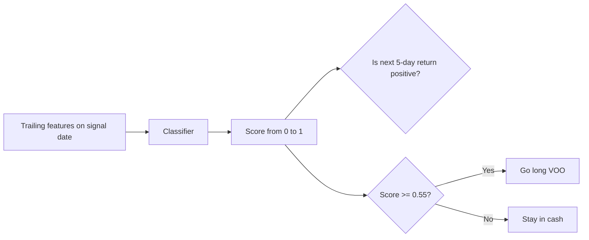
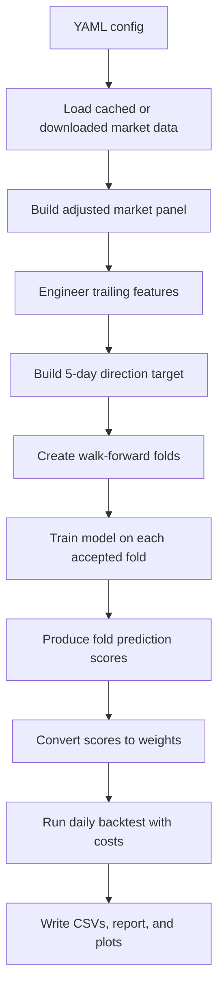
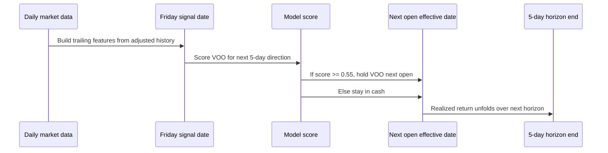

# How MarketLab Works

MarketLab is a research toolkit for running repeatable market experiments from a YAML config to a full set of review artifacts. It is designed to answer questions like:

- What happens if I use a simple rule-based strategy?
- What happens if I train a model on past market behavior?
- Do the model's scores look useful, calibrated, and stable?
- Does better classifier quality actually turn into better realized returns?

The current library is built for research, not live trading. It is good at making assumptions explicit, replaying the same workflow, and showing why a result happened. It is not claiming that a model is ready for production deployment.

This explainer uses the current weekly `VOO` timing example at `configs/experiment.voo_long_only.ytd.yaml` and the local run directory `artifacts/runs/voo_long_only_ytd/20260403T080623Z/`.

Phase 7 also adds separate daily paper-trading configs at `configs/experiment.qqq_paper_daily.yaml` and `configs/experiment.voo_paper_daily.yaml`. Those newer configs are intentionally operational: they use a six-model consensus proposal, an autonomous approval worker, and paper-account state artifacts. This explainer stays focused on the weekly research example because it is easier to read as a standalone methodology walkthrough.

## What Problem The Library Is Solving

At a high level, MarketLab tries to separate three questions that people often mix together:

1. Can a model predict the target better than chance?
2. Can those predictions be turned into a trading rule?
3. Does that trading rule beat simple baselines after costs?

Those are not the same question.

A model can look decent on `ROC AUC` and still produce a weak trading strategy. A strategy can have lower drawdown simply because it is in cash more often. A strong backtest can also be caused by a short sample, a small universe, or favorable market regime.

The library is structured to keep those layers separate:

- data and feature engineering
- target construction
- walk-forward training and evaluation
- score-to-weight strategy construction
- backtest and cost application
- artifact writing and reporting

## The Core Idea In Plain English

MarketLab takes daily market data, turns it into trailing features, asks a model to predict a defined target, converts the model's score into a portfolio decision, and then backtests the result against simple baselines like `buy_hold` and `sma`.

For the `VOO` example, the question is:

> On each weekly rebalance, should the strategy be invested in `VOO` next week, or should it stay in cash?

That is a directional timing problem, not a cross-sectional stock-picking problem.

The current config answers that question with a supervised classification target:

- the label is whether the next 5-day return is positive
- the model outputs a score between `0` and `1`
- the score is used like a confidence signal for "next 5-day direction is up"

In this specific configuration:

- if `score >= 0.55`, go long `VOO`
- if `score < 0.55`, hold cash

That one rule is what creates actual trading differences between models in this run.

## How The Models And Scores Work

### What the target means

The target is `type: "direction"` with `horizon_days: 5`.

That means each weekly modeling row answers a yes/no question:

> Was the forward 5-day return positive after this signal date?

So the model is not asked to forecast the exact return, volatility, or drawdown. It is only asked to estimate the probability that the next horizon ends positive.

### What the features mean

The features are trailing-only:

- trailing returns over `5`, `10`, `20`, and `40` days
- moving-average windows `10`, `20`, and `50`
- rolling volatility windows `10` and `20`
- momentum window `20`

These are all built from information available on the signal date. They do not look forward into the label window.

### What a model score means

For a direction model, the score is produced from `predict_proba()`. A score near:

- `0.50` means weak directional conviction
- `1.00` means high confidence the target will be positive
- `0.00` means high confidence the target will be negative

In this `long_only` example, low scores do not create short positions. They simply fail the long-entry gate and leave the strategy in cash.

### Why classifier quality is not the same as strategy quality

This run shows that clearly:

- `logistic_l1` has the best mean `ROC AUC` at `0.539630`
- `extra_trees` has the best realized gated strategy return

That is not a contradiction. It means:

- one model ranked positive vs negative horizons slightly better on average
- another model happened to make better in/out exposure decisions at the chosen `0.55` gate

Those are different tasks.

### Score review artifacts

MarketLab writes calibration and threshold diagnostics so the score can be inspected instead of treated like magic.

*Calibration curves show whether higher model scores line up with higher observed positive rates in the actual `VOO` run.*

*Score histograms show how each model spreads positive and negative examples across the score range.*

*Threshold sweeps show how precision, recall, balanced accuracy, and predicted-positive rate move as the entry threshold changes.*

### Quick glossary

- `signal date`: the date used to compute features and decide whether to trade
- `effective date`: the next market open when the rebalance becomes active
- `horizon`: how far forward the target looks, here `5` trading days
- `fold`: one walk-forward train/test slice
- `threshold`: the minimum score required to enter the long position
- `cash underfilled`: missing exposure stays at zero instead of being renormalized into a full position
- `cost drag`: the amount of return lost to turnover-based trading costs

## Running Example: `voo_long_only_ytd`

This explainer uses the tracked config at `configs/experiment.voo_long_only.ytd.yaml`.

The current settings are:

- universe: `VOO` only
- raw data window: `2018-01-01` to `2026-04-03`
- target: 5-day direction
- rebalance rule: `W-FRI`
- execution: next market open
- strategy mode: `long_only`
- entry threshold: `0.55`
- cash behavior: `cash_when_underfilled: true`
- costs: `10` bps per unit turnover

The current example config compares these five models:

- `logistic_regression`
- `logistic_l1`
- `random_forest`
- `extra_trees`
- `gradient_boosting`

The broader library supports a six-model lightweight sklearn comparison set in the default weekly configs. This particular `VOO` example currently uses five because it is a focused timing case study.

## End-To-End Methodology

The library workflow for this run is:

For this specific config, the walk-forward settings are:

- `train_years: 3`
- `test_months: 3`
- `step_months: 3`
- `embargo_periods: 1`
- `min_train_rows: 100`
- `min_test_rows: 10`
- `min_train_positive_rate: 0.05`
- `min_test_positive_rate: 0.05`

That means the experiment repeatedly:

1. trains on about three years of weekly rows
2. tests on the next three months
3. moves forward by three months
4. skips folds that do not meet the guardrails

In the completed run:

- used fold candidates: `19`
- skipped fold candidates: `1`
- skipped reason: `incomplete_test_window;insufficient_test_rows;insufficient_test_positive_rate`

## What Happens On Each Rebalance

The timing rules matter because they define what is knowable when the strategy trades.

The important domain rules are:

- weekly signals come from the last close in the `W-FRI` period
- rebalances execute on the next market open
- adjusted open and adjusted close are used so splits and dividends do not distort return math
- trading costs are applied as turnover-based basis points
- missing exposure is cash earning zero

For this `long_only` strategy:

- a passing score creates a `+1.0` long weight in `VOO`
- a failing score leaves the portfolio at `0.0`

## What The Artifacts Mean

MarketLab writes different artifact families for different questions.

### Execution and strategy outcome

- `strategy_summary.csv`: high-level strategy outcomes
- `performance.csv`: daily equity and returns
- `metrics.csv`: compact strategy metrics
- `report.md`: narrative report for the run

### Model quality

- `model_summary.csv`: model-level averages across folds
- `fold_summary.csv`: per-fold summary and winner fields
- `ranking_diagnostics.csv`: how scores relate to top-bucket decisions
- `calibration_diagnostics.csv`: whether scores align with observed positive rates
- `threshold_diagnostics.csv`: what changes as the decision threshold moves

### Walk-forward validity

- `fold_diagnostics.csv`: which candidate folds were used or skipped, and why

For this explainer, the local evidence came from:

- config: `configs/experiment.voo_long_only.ytd.yaml`
- gated run: `artifacts/runs/voo_long_only_ytd/20260403T080623Z/`
- earlier always-long comparison run: `artifacts/runs/voo_long_only_ytd/20260403T075531Z/`

## What Happened In This VOO Run

### Why the earlier single-symbol run made every model look the same

Before the threshold was added, the same `VOO` experiment was run in a simpler `long_only` form with no confidence gate. In the local run `artifacts/runs/voo_long_only_ytd/20260403T075531Z/`, every ML strategy finished with the same realized result:

- cumulative return: `0.853288`
- annualized return: `0.132898`
- max drawdown: `-0.245833`

That happened because there was only one asset to choose from and no threshold to keep the strategy in cash. Each model kept selecting `VOO`, so realized execution converged even though the model diagnostics were different.

### Why the `0.55` threshold creates differentiation

With `min_score_threshold: 0.55` and `cash_when_underfilled: true`, the strategy is no longer always invested. Each model is now different in how often it says "the score is strong enough to enter."

Average predicted-positive rate at threshold `0.55`:

- `extra_trees`: `0.543088`
- `gradient_boosting`: `0.486119`
- `logistic_l1`: `0.480914`
- `logistic_regression`: `0.473684`
- `random_forest`: `0.437825`

That is why the realized ML strategies finally separate from each other.

### Strategy outcome table

| strategy | cumulative_return | annualized_return | max_drawdown | total_turnover | cost_drag |
| --- | ---: | ---: | ---: | ---: | ---: |
| buy_hold | 0.858004 | 0.133480 | -0.245833 | 0.0 | 0.000000 |
| sma | 0.268731 | 0.049316 | -0.288724 | 22.0 | 0.028253 |
| ml_extra_trees__long_only__thr0p55__cash | 0.440322 | 0.076584 | -0.233559 | 54.0 | 0.079932 |
| ml_gradient_boosting__long_only__thr0p55__cash | -0.103959 | -0.021956 | -0.244781 | 82.0 | 0.076600 |
| ml_logistic_l1__long_only__thr0p55__cash | 0.108610 | 0.021072 | -0.243801 | 59.0 | 0.067422 |
| ml_logistic_regression__long_only__thr0p55__cash | 0.122776 | 0.023698 | -0.234035 | 65.0 | 0.075432 |
| ml_random_forest__long_only__thr0p55__cash | 0.070383 | 0.013851 | -0.261509 | 86.0 | 0.096117 |

The main outcome is straightforward:

- `buy_hold` was still best
- `extra_trees` was the best ML timing path
- `sma` beat most gated ML strategies, but lost to `extra_trees`

The reason the gated models still lagged `buy_hold` is also straightforward: this sample contains a generally rising market, and the gate often leaves the strategy in cash. That lowers exposure and reduces participation in the uptrend.

*Cumulative returns show `buy_hold` staying ahead because it remains fully invested while the gated models repeatedly step out of the market.*

*Drawdown shows some gated strategies looking gentler, but that partly reflects lower exposure rather than clearly better selection.*

*Turnover shows that the gated ML strategies pay materially more trading costs than `buy_hold`, and usually more than `sma` as well.*

### Model interpretation table

| model_name | mean_roc_auc | mean_balanced_accuracy | mean_ece | threshold_0p55_predicted_positive_rate | interpretation |
| --- | ---: | ---: | ---: | ---: | --- |
| logistic_l1 | 0.539630 | 0.530163 | 0.218330 | 0.480914 | Best classifier by ROC AUC, but the gate still leaves too much upside uncaptured. |
| logistic_regression | 0.511497 | 0.496098 | 0.248427 | 0.473684 | Similar to logistic L2 baseline, but weaker both as classifier and realized timer. |
| random_forest | 0.490464 | 0.556802 | 0.247308 | 0.437825 | Best balanced accuracy, but too selective and too costly in this rising sample. |
| extra_trees | 0.487857 | 0.529954 | 0.214830 | 0.543088 | Middling classifier, but the best execution path because it stayed invested more effectively at the chosen threshold. |
| gradient_boosting | 0.456784 | 0.486874 | 0.436233 | 0.486119 | Weakest calibration and the worst realized strategy, despite sometimes catching rallies. |

The key lesson is that model ranking changes depending on what you ask:

- by classifier discrimination, `logistic_l1` looks best
- by realized gated strategy return, `extra_trees` looks best
- by simple fully invested exposure, `buy_hold` is still best overall

## Safe Interpretation

- This is a clean timing-study example, not proof of a durable trading edge.
- The experiment is useful because it shows how MarketLab connects model scores to actual trading exposure.
- The `0.55` gate is doing real work: it changes exposure enough to reveal differences between models.
- The best realized ML strategy in this sample does not come from the best `ROC AUC` model. That is an important and healthy result, because it shows why the library keeps classifier diagnostics and realized strategy results separate.
- Lower drawdown here should be read carefully. A strategy can look safer simply because it sits in cash more often.
- In a one-symbol study, the main question is timing quality against `buy_hold` and `sma`, not cross-sectional ranking skill.

## Caveats

- This is a one-symbol experiment on `VOO`, so it is a timing study, not a ranking benchmark.
- The current tracked example uses five models, even though the broader default weekly configs compare six.
- The local evidence depends on one specific threshold choice: `0.55`.
- The gate changes exposure, so the comparison with `buy_hold` is partly a comparison between always-invested and sometimes-cash behavior.
- Turnover and cost sensitivity matter. Several ML strategies give up a meaningful amount of return through cost drag.
- Calibration and threshold diagnostics help explain score behavior, but they do not prove that the same threshold will remain optimal in future data.
- This remains research infrastructure. It is useful because it makes assumptions and tradeoffs visible, not because it proves any model is production-ready.
